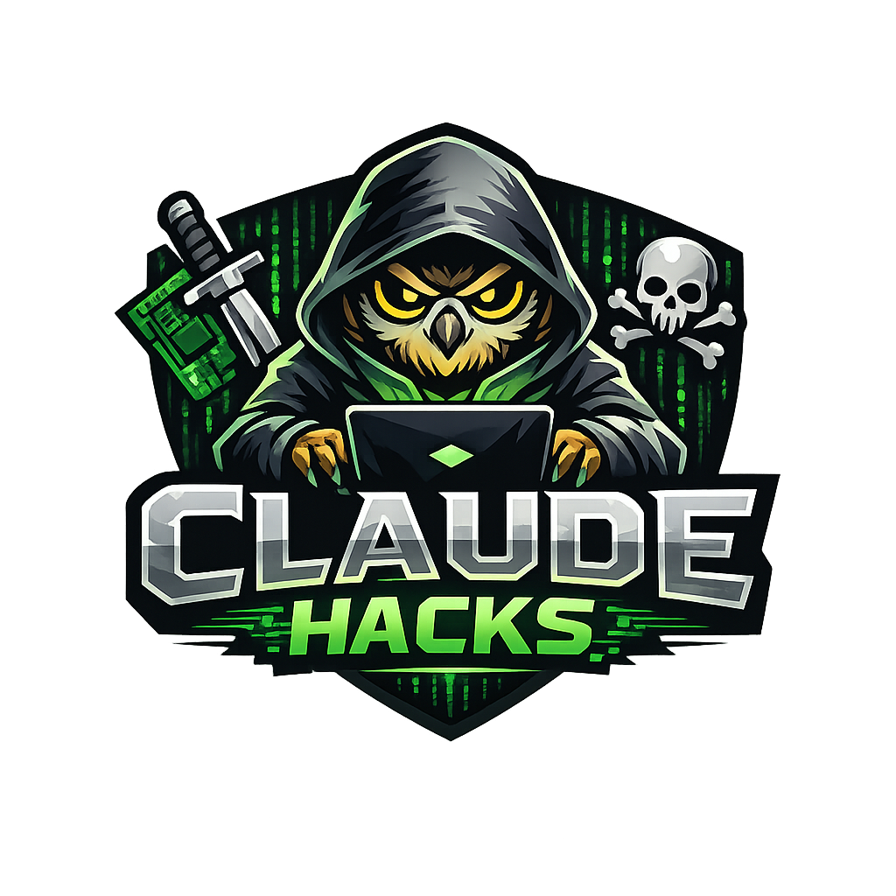

  

# Claude Hacks

A handpicked collection of Claude hacks, prompts, and resources to unlock more power, speed, and creativity from your AI workflows.

## Useful repositories
- [Claude Code Templates](https://github.com/davila7/claude-code-templates): CLI tool for configuring and monitoring Claude Code
- [Everything Claude Code](https://github.com/affaan-m/everything-claude-code): About
The agent harness performance optimization system. Skills, instincts, memory, security, and research-first development for Claude Code, Codex, Opencode, Cursor and beyond
- [AI Website Cloner Template](https://github.com/JCodesMore/ai-website-cloner-template): A reusable template for reverse-engineering any website into a clean, modern Next.js codebase using AI coding agents
- [Paperclip](https://github.com/paperclipai/paperclip): Open-source orchestration for zero-human companies

## Skills
- [Promp Master](https://github.com/nidhinjs/prompt-master): A Claude skill that writes the accurate prompts for any AI tool. Zero tokens or credits wasted. Full context and memory retention
